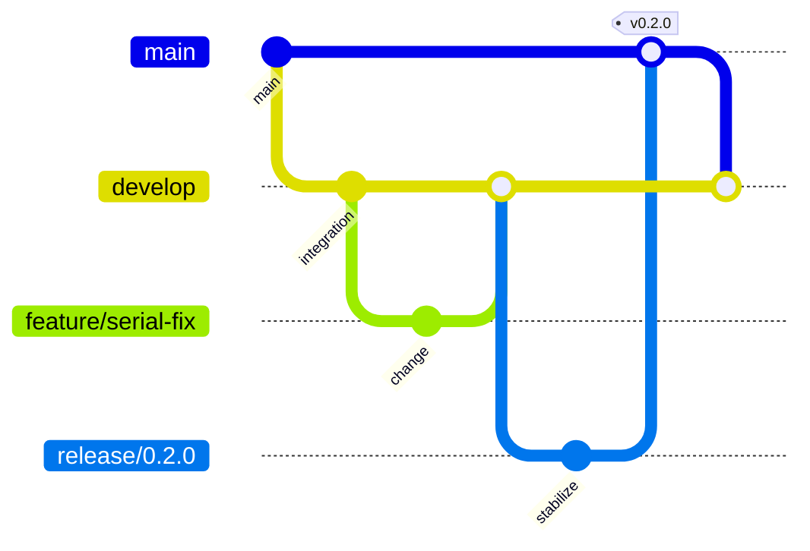

# Contributing

Thank you for improving `platform_serial`.

## Development setup

Use the platform-specific setup script:

| Platform | Command |
| --- | --- |
| Windows | `./scripts/windows/setup-devenv.ps1 -Yes` |
| Linux | `./scripts/linux/setup-devenv --yes` |
| macOS | `./scripts/macos/setup-devenv --yes` |

Then run:

```bash
flutter pub get
flutter analyze --fatal-infos --fatal-warnings
flutter test --coverage
dart run tool/coverage_gate.dart --lcov coverage/lcov.info --min-lines 100
```

## Branching model

Use GitFlow:



Direct pushes to `main`, `develop`, and `dev` are not allowed. Repository administrators must apply `.github/rulesets/gitflow-branch-protection.json` in GitHub settings.

## Pull request checklist

- [ ] Code is documented where it changes public behavior.
- [ ] Tests cover the change and keep coverage at 100% for the configured coverage scope.
- [ ] `flutter analyze --fatal-infos --fatal-warnings` passes.
- [ ] `flutter pub publish --dry-run` passes for release-impacting changes.
- [ ] Documentation is updated when user-facing behavior changes.
