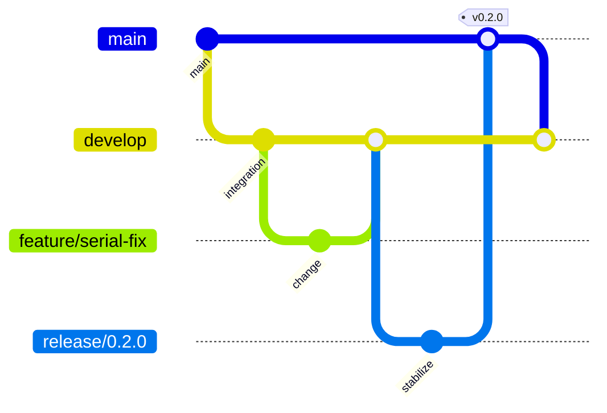

# Contributing

Thank you for improving `platform_serial`.

## Development setup

Use the platform-specific setup script:

| Platform | Command |
| --- | --- |
| Windows | `.\scripts\windows\setup\setup-devenv.ps1 -Yes` |
| Linux | `scripts/linux/setup/setup-devenv --yes` |
| macOS | `scripts/macos/setup/setup-devenv --yes` |

Then install the git hooks (one-time setup):

```bash
# Linux / macOS
.githooks/install.sh

# Windows
.githooks\install.ps1
```

The hooks enforce quality locally — see [doc/HOOKS.md](doc/HOOKS.md).

Then run the quality gate:

```bash
flutter pub get
flutter analyze --fatal-infos --fatal-warnings
flutter test --coverage
dart run tool/coverage_gate.dart --lcov coverage/lcov.info --min-lines 100
```

## Branching model

Use GitFlow:



Direct pushes to `main`, `develop`, and `dev` are not allowed. Repository administrators must apply `.github/rulesets/gitflow-branch-protection.json` in GitHub settings.

## Pull request checklist

- [ ] `flutter analyze --fatal-infos --fatal-warnings` passes.
- [ ] `flutter test --coverage` passes with 100% line coverage.
- [ ] Code is documented with `///` where it changes public behavior.
- [ ] Tests cover the change and keep coverage at 100% for the configured scope.
- [ ] `CHANGELOG.md` updated for user-facing changes.
- [ ] `flutter pub publish --dry-run` passes for release-impacting changes.
- [ ] Documentation updated when user-facing behavior changes.
- [ ] Commit messages follow [Conventional Commits](https://conventionalcommits.org).

## PR pipeline

Every PR triggers `.github/workflows/test-pr.yml` which runs:

1. **`📊 Analyze & Validate`** — `flutter analyze` + `pub publish --dry-run`
2. **`🧪 Tests & Coverage`** — full test suite + 100% coverage gate
3. **`📝 Commit Conventions`** — validates commit message format
4. **`🔬 Example Smoke Test`** — example widget tests + Linux build
5. **`🐳 Docker Compose Validation`** — validates container definitions
6. **`✅ PR Status Check`** — aggregator; **must pass before merge**

Merge into `main`, `develop`, or `dev` is blocked by GitHub branch
protection until **`✅ PR Status Check`** succeeds.
