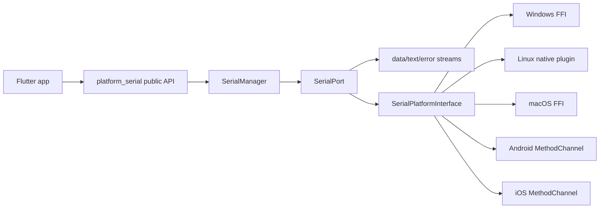
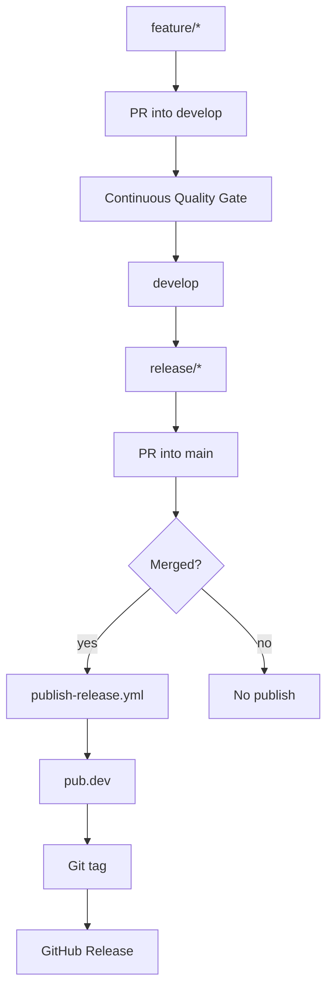

<!-- Copyright (c) 2026 Piergiorgio Vagnozzi. -->
<!-- Licensed under the MIT License. -->
# 📡 platform_serial

[](https://dart.dev)
[](https://flutter.dev)
[](#platform-support)
[](LICENSE)

> 🔌 Professional cross-platform serial communication plugin for Flutter with sync/async I/O, streaming, typed errors, native bridge support, and a hardened GitFlow release pipeline.

---

## ✨ Features

- Unified API (`SerialManager`, `SerialPort`) across supported platforms.
- Binary and text communication (`read`, `readSync`, `readUntil`, `write`, `writeText`).
- Real-time streams (`dataStream`, `textStream`, `errorStream`).
- Typed error model (`SerialError`, `SerialErrorType`).
- DTR/RTS output control and CTS/DSR/DCD status snapshots where the platform backend supports modem-control lines.
- Mock-friendly platform boundary for deterministic unit, integration, and e2e tests.
- Professional repository assets: Copilot instructions, custom agents, skills, MCP config, CODEOWNERS, issue/PR templates, Dependabot, GitFlow ruleset, and cross-platform setup scripts.

---

## Platform Support

| Platform | Implementation | Status |
|---|---|---|
| Windows | FFI (`platform_serial.dll`) | ✅ Supported |
| macOS | FFI (`DynamicLibrary.process`) | ✅ Supported |
| Linux | FFI/native plugin | ✅ Supported |
| Android | MethodChannel | ✅ Supported |
| iOS | MethodChannel | ✅ Supported |
| Web | Not applicable to serial hardware | ❌ Not supported |

---

## Architecture



`SerialManager` owns the open-port registry. `SerialPort` owns per-port state, read/write helpers, and stream translation. Platform implementations stay behind `SerialPlatformInterface` so tests can inject mocks without physical serial hardware.

---

## Quick Start

```dart
import 'package:platform_serial/platform_serial.dart';

final manager = SerialManager();
final ports = await manager.getAvailablePorts();

final port = await manager.openPort('COM3', baudRate: 115200, dataBits: 8);
await port.writeText('AT\r\n');
final response = await port.readUntil('\n');
await manager.closePort('COM3');
```

---

## Development setup

Use one of the synchronized setup scripts:

```bash
scripts/linux/setup-devenv --yes
scripts/macos/setup-devenv --yes
```

```powershell
scripts/windows/setup-devenv.ps1 -Yes
```

The scripts install or verify Git, Flutter, Android Studio, Oh My Posh, the `M365Princess` theme, and shell startup integration. See [`scripts/README.md`](scripts/README.md).

---

## Build, Lint and Test

```bash
flutter pub get
flutter analyze --fatal-infos --fatal-warnings
flutter test --coverage
dart run tool/coverage_gate.dart --lcov coverage/lcov.info --min-lines 100
```

Example app tests:

```bash
cd example
flutter pub get
flutter test
```

---

## GitFlow and release workflow



Direct pushes to protected GitFlow branches must be blocked in GitHub repository rulesets. This repository includes `.github/rulesets/gitflow-branch-protection.json` and a scheduled policy audit workflow, but GitHub branch protection must be applied by a repository administrator.

Publishing uses pub.dev trusted publishing/OIDC from the protected `pub-dev` GitHub environment. No long-lived pub.dev token or Google service-account JSON key should be required.

---

## Documentation

Start from [`doc/INDEX.md`](doc/INDEX.md). Key operational documents:

- [`doc/GITFLOW.md`](doc/GITFLOW.md)
- [`doc/GITHUB_SETUP.md`](doc/GITHUB_SETUP.md)
- [`AGENTS.md`](AGENTS.md)
- [`CONTRIBUTING.md`](CONTRIBUTING.md)
- [`SECURITY.md`](SECURITY.md)

---

## License

This project is licensed under the **MIT License**. See [LICENSE](LICENSE).
