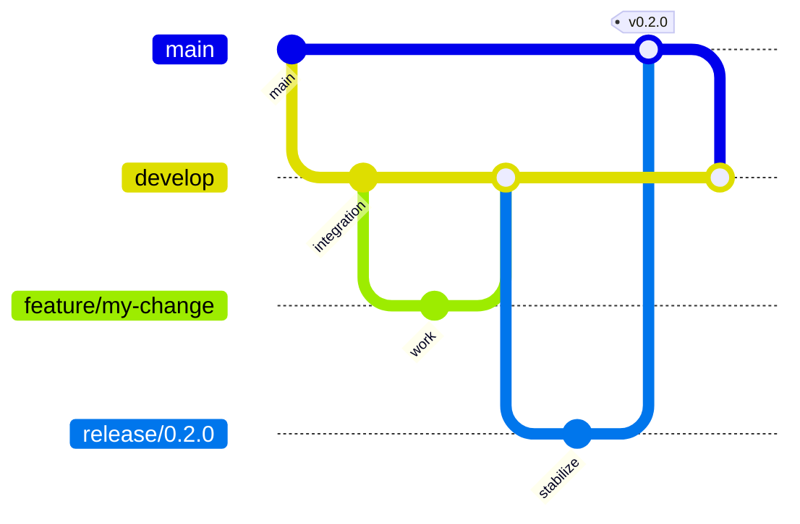
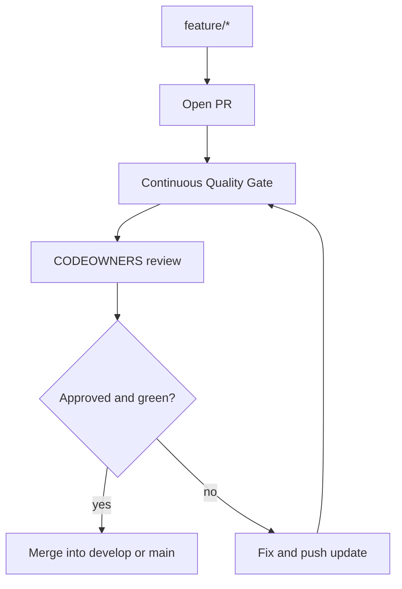
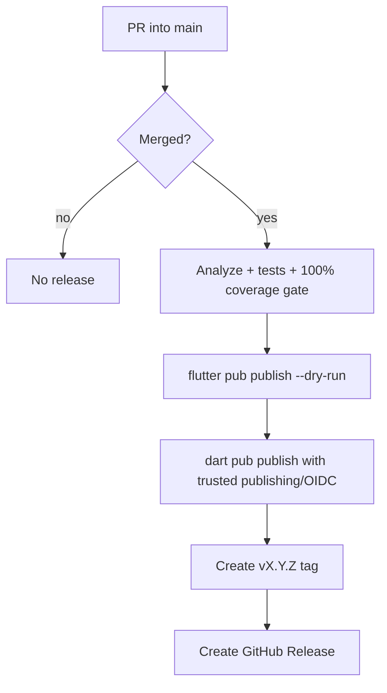

# GitFlow Workflow

`platform_serial` uses GitFlow with protected long-lived branches and release publishing after a PR is merged into `main`.

## Branch model



| Branch | Purpose | Rule |
| --- | --- | --- |
| `main` | Published releases only | PR required; direct push blocked |
| `develop` | Integration branch | PR required; direct push blocked |
| `dev` | Transitional integration alias if present | PR required; direct push blocked |
| `feature/*` | New work | Merge into `develop` |
| `release/*` | Stabilization | Merge into `main`, then back to `develop` |
| `hotfix/*` | Urgent production fixes | Branch from `main`, merge into `main` and `develop` |

## Required GitHub ruleset

Repository files cannot make direct pushes impossible by themselves; GitHub must enforce it server-side. Apply `.github/rulesets/gitflow-branch-protection.json` in **Settings → Rules → Rulesets** or through the GitHub API.

Required protections:

- pull request before merge;
- at least one approval;
- CODEOWNERS review for sensitive paths;
- stale approvals dismissed on new commits;
- required status check: `PR Status Check`;
- force-push and branch deletion disabled;
- no bypass actors by default.

The scheduled `GitFlow Policy Audit` workflow reports if `main` or `develop` is not protected.

## Pull request workflow



## Release workflow



The release workflow is `.github/workflows/publish-release.yml` and uses the protected GitHub environment `pub-dev`.

## Versioning

`pubspec.yaml` is the source of truth for the package version. Manual dispatch may pass a version, but it must match `pubspec.yaml` or the workflow fails.

## Local validation

```bash
flutter pub get
flutter analyze --fatal-infos --fatal-warnings
flutter test --coverage
dart run tool/coverage_gate.dart --lcov coverage/lcov.info --min-lines 100
flutter pub publish --dry-run
```
