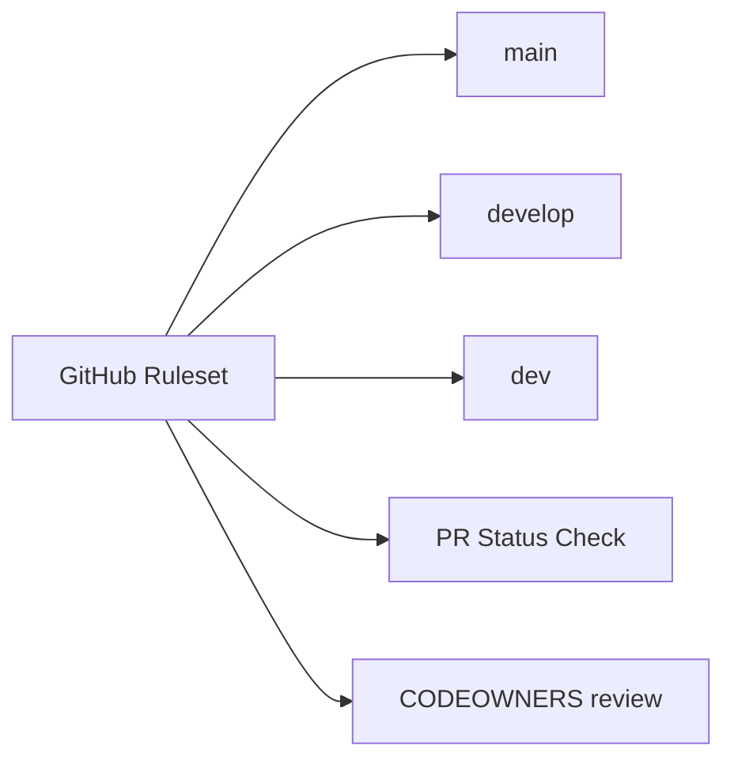

# GitHub Setup Guide

This guide describes the repository settings that cannot be fully enforced by files committed to the repository.

## 1. Apply branch protection / rulesets

Apply `.github/rulesets/gitflow-branch-protection.json` to protect `main`, `develop`, and `dev`.

Recommended GitHub UI path:

1. Open **Settings → Rules → Rulesets**.
2. Create a new branch ruleset or import the JSON policy.
3. Target `main`, `develop`, and `dev`.
4. Enable:
   - pull request required;
   - one approval minimum;
   - CODEOWNERS review;
   - stale review dismissal;
   - required status check `PR Status Check`;
   - block force pushes and deletion.



## 2. Configure pub.dev trusted publishing

The release workflow uses OIDC trusted publishing instead of long-lived pub.dev or Google service-account JSON secrets.

In pub.dev package administration, configure a trusted publisher for:

| Field | Value |
| --- | --- |
| Repository | `pvagnozzi/platform_serial` |
| Workflow | `.github/workflows/publish-release.yml` |
| Environment | `pub-dev` |
| Package | `platform_serial` |

In GitHub, create the environment **`pub-dev`** and require reviewer approval if desired.

## 3. Workflows

| Workflow | Purpose |
| --- | --- |
| `.github/workflows/test-pr.yml` | Analyze root/example, run tests with coverage, enforce 100% LCOV line coverage, and validate pub metadata. |
| `.github/workflows/publish-release.yml` | Publish to pub.dev after a PR is merged into `main`, then create tag and GitHub Release. |
| `.github/workflows/gitflow-policy.yml` | Scheduled/manual audit that reports unprotected GitFlow branches. |

## 4. Required secrets

No secret is required for pub.dev publishing when trusted publishing is configured correctly.

Optional secrets:

| Secret | Purpose |
| --- | --- |
| `CODECOV_TOKEN` | Optional Codecov upload token for private repositories or stricter Codecov settings. |

Do **not** add long-lived pub.dev tokens or Google service-account JSON keys for release publishing.

## 5. Local setup

Developers can bootstrap their machines with:

```bash
scripts/linux/setup-devenv --yes
scripts/macos/setup-devenv --yes
```

```powershell
scripts/windows/setup-devenv.ps1 -Yes
```

## 6. Release checklist

1. Update `pubspec.yaml` version.
2. Update `CHANGELOG.md`.
3. Open PR into `main` from `release/*` or `hotfix/*`.
4. Ensure `PR Status Check` passes.
5. Merge PR.
6. Confirm `publish-release.yml` published to pub.dev and created `vX.Y.Z` GitHub Release.
