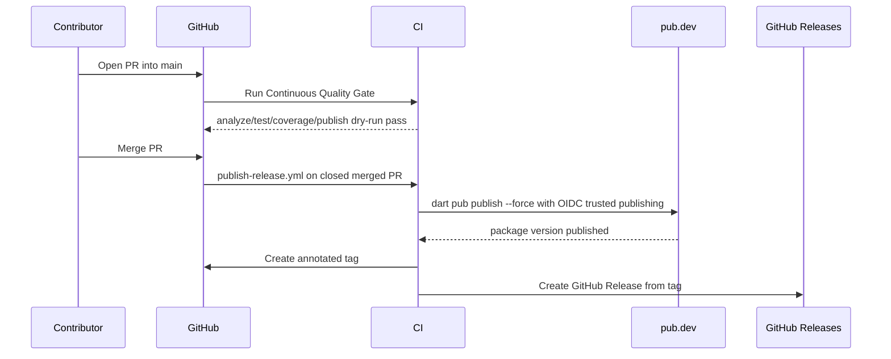
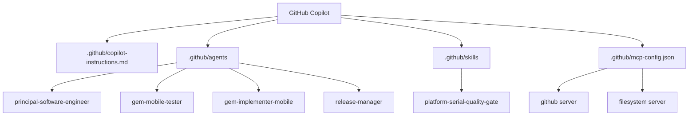

# Professionalization Plan

This document summarizes the repository hardening baseline for `platform_serial`.

## Quality workflow

```mermaid
flowchart LR
  Dev[Developer or agent] --> Setup[setup-devenv script]
  Setup --> Edit[Code or docs change]
  Edit --> Analyze[flutter analyze --fatal-infos --fatal-warnings]
  Analyze --> Tests[flutter test --coverage]
  Tests --> Gate[coverage_gate.dart --min-lines 100]
  Gate --> PR[Pull request]
  PR --> Review[CODEOWNERS review]
  Review --> Merge[Merge into protected branch]
```

## Release workflow

## Branch protection

Repository files can document and audit branch policy, but GitHub server-side rules are what make direct pushes impossible. Apply `.github/rulesets/gitflow-branch-protection.json` to protect:

- `main`
- `develop`
- transitional `dev`

Required policy:

- pull request required;
- at least one approving review;
- CODEOWNERS review for sensitive paths;
- stale approvals dismissed after new commits;
- required `PR Status Check` status;
- force-push and deletion blocked;
- no bypass actors unless explicitly approved by maintainers.

## Agent, skill and MCP assets

## Coverage policy

The CI gate enforces 100% line coverage for the configured LCOV scope. Hardware-only native backends should either be tested in platform-specific CI with the required toolchain/device access or explicitly excluded from the default mock-only coverage scope with a documented reason.

Current local baseline after initial audit was below the target because native platform adapters are included in LCOV without platform/device execution. The new gate makes the target explicit so future PRs cannot silently reduce the configured coverage scope.
