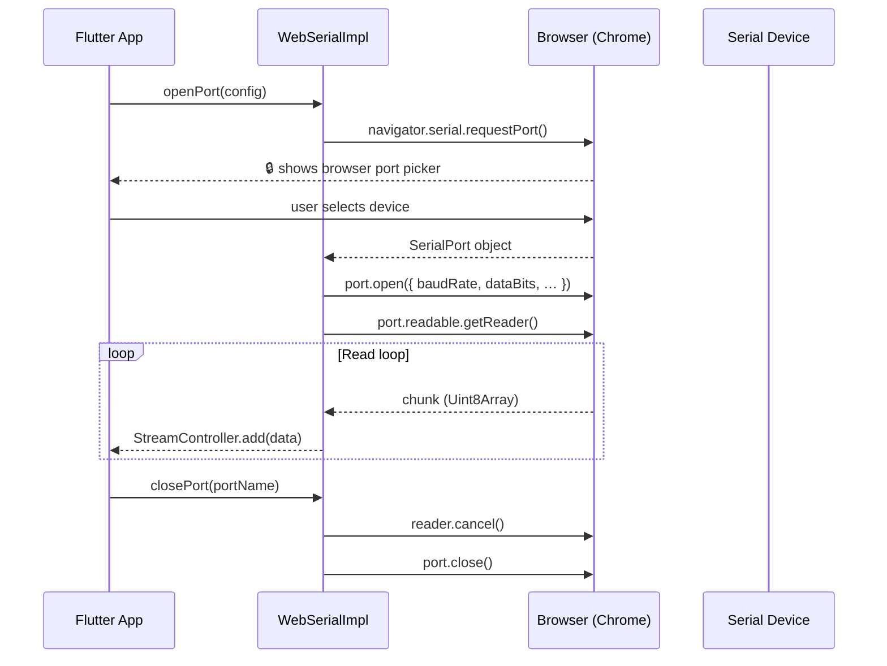

# Web & WASM Support

platform_serial supports the [Web Serial API](https://developer.mozilla.org/en-US/docs/Web/API/Web_Serial_API) on Flutter Web (both JS and WASM compilation targets).

---

## Browser requirements

| Browser | Minimum version | Notes |
|---------|----------------|-------|
| Chrome | 89+ | Full support |
| Edge | 89+ (Chromium) | Full support |
| Firefox | ❌ Not supported | Serial API behind a flag, not production-ready |
| Safari | ❌ Not supported | No implementation |
| Opera | 75+ | Based on Chromium |

> **HTTPS is mandatory.** The Web Serial API is restricted to secure origins.  
> `http://localhost` is the only allowed insecure exception (for local development).

---

## Conditional import pattern (WASM-compatible)

The platform factory uses `dart.library.js_interop` (not the deprecated
`dart.library.html`) so that the same code tree compiles to both JS and WASM:

```dart
// serial_platform_interface.dart
import 'serial_platform_factory_stub.dart'
    if (dart.library.js_interop) 'serial_platform_factory_web.dart'
    if (dart.library.io)         'serial_platform_factory_io.dart';
```

| Condition | Factory selected | Implementation |
|-----------|-----------------|----------------|
| `dart.library.js_interop` (web/wasm) | `serial_platform_factory_web.dart` | `WebSerialImpl` |
| `dart.library.io` (native) | `serial_platform_factory_io.dart` | `WindowsSerialImpl` / `MethodChannelSerialPlatformInterface` |
| Neither (unsupported) | `serial_platform_factory_stub.dart` | throws `SerialErrorType.platformUnavailable` |

---

## Web Serial API flow



---

## Limitations on Web

| Feature | Native | Web |
|---------|--------|-----|
| List available ports | ✅ | ⚠️ returns only previously-granted ports |
| Open port (user picker) | ✅ | ✅ via `requestPort()` |
| Read / Write | ✅ | ✅ |
| Control signals (DTR, RTS, CTS…) | ✅ | ❌ throws `platformUnavailable` |
| Flow control: hardware | ✅ | ✅ mapped to `hardware` |
| Flow control: XON/XOFF | ✅ | ⚠️ mapped to `hardware` |
| Stop bits: 1.5 | ✅ | ⚠️ mapped to `1` |
| Parity: mark / space | ✅ | ⚠️ mapped to `none` |

---

## Running the example on Web

### Debug (JS, hot reload)

```bash
cd example
flutter run -d chrome
```

### Debug (WASM, hot restart only)

```bash
cd example
flutter run -d chrome --wasm
```

### Production build (JS)

```bash
cd example
flutter build web
# serve build/web/ from an HTTPS origin
```

### Production build (WASM)

```bash
cd example
flutter build web --wasm
# serve build/web/ from an HTTPS origin
```

### Local dev server (HTTPS via mkcert)

```bash
# Install mkcert once
mkcert -install
mkcert localhost

# Serve with caddy or python
caddy file-server --listen :8443 --root example/build/web --tls localhost.pem --tls-key localhost-key.pem
# or
cd example && flutter run -d web-server --web-port 8080
# then access via http://localhost:8080 (localhost is exempt from HTTPS)
```

---

## VS Code launch configurations

The example ships with `.vscode/launch.json` containing ready-to-use
configurations for **all platforms**:

| Configuration | Platform |
|--------------|----------|
| Example — Windows (Debug) | Windows native |
| Example — Windows (Profile) | Windows profile |
| Example — Linux (Debug) | Linux native |
| Example — macOS (Debug) | macOS native |
| Example — Android (Debug) | Android device/emulator |
| Example — Android (Profile) | Android profile |
| Example — iOS (Debug) | iOS device/simulator (macOS only) |
| Example — Chrome (Web, JS) | Web — JS compilation |
| Example — Chrome (Web, WASM) | Web — WASM compilation |
| Example — Web Server :8080 (JS) | Headless web server, JS |
| Example — Web Server :8080 (WASM) | Headless web server, WASM |
| Example — All Devices | All connected devices |

IntelliJ / Android Studio run configurations are in
`example/.idea/runConfigurations/`.

---

## Testing

Web-specific tests are in `test/unit/web_platform_test.dart`.
Because the Web Serial API requires a real browser, the tests cover:

- Conditional import selection (stub on dart:io)
- `SerialError` construction and serialization
- `SerialPlatformInterface` factory behaviour on non-web runtimes

Full browser integration tests require a Selenium/Playwright driver and
are outside the scope of the standard `flutter test` suite.
